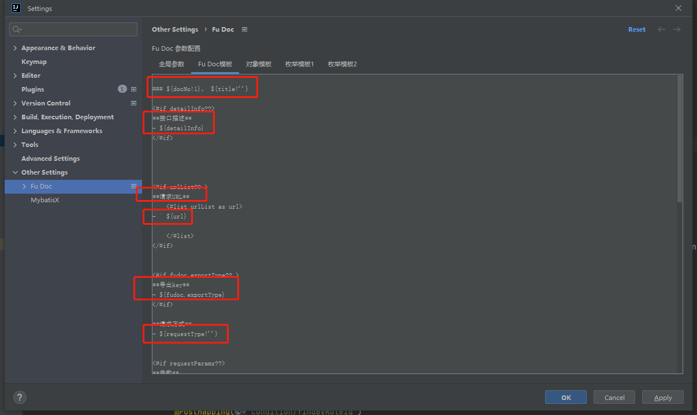
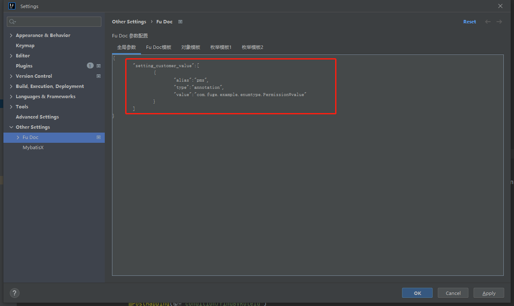
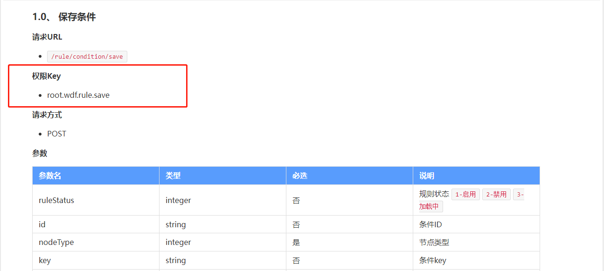
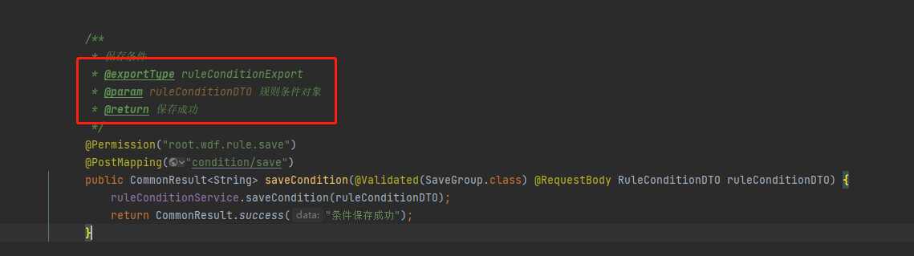
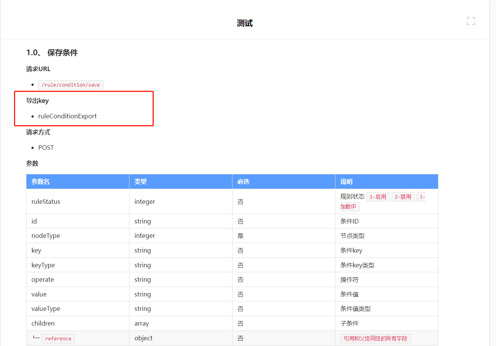

## 动态接口文档模板

!> 注意：由于需要支持markdown格式 配置模板中所有用于渲染的内容（除指令标签之外） 前面均不能有空格 必须完全靠左 如下图所示


?> 动态接口文档模板底层通过`freemarker`来将数据渲染到模板中 所以在模板中可直接使用`freemarker`指令


### 自定义数据

- 在配置页面配置自定义数据配置项



- 在模板中使用自定义数据配置项

```injectedfreemarker
<#if fudoc.pms?? >
**PmsKey权限**
- ${fudoc.pms}
</#if>

```

- 生成接口文档后的效果


?> 在配置页面配置了`setting_customer_value`属性后 可以直接在模板中使用`fudoc.alais`来读取自定义数据

---


### 注释tag

- 在代码里编写注释tag



- 在模板中使用注释tag

```injectedfreemarker
<#if fudoc.exportType?? >
**导出key**
- ${fudoc.exportType}
</#if>
```

- 生成接口文档后的效果




?> 不需要任何配置 可以直接在模板中使用`fudoc.tag`来读取注释中指定tag的内容