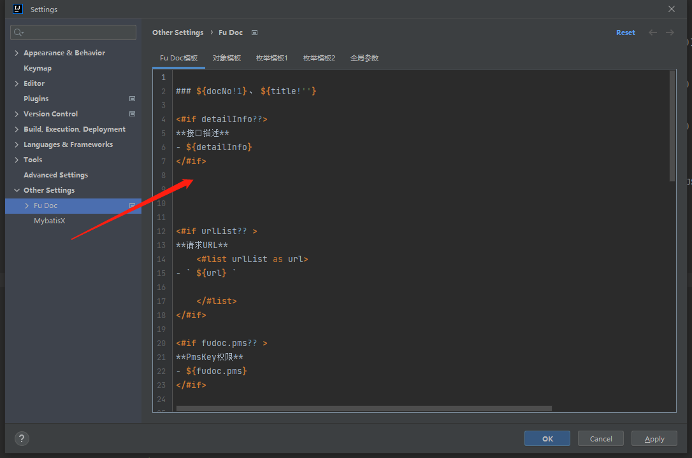
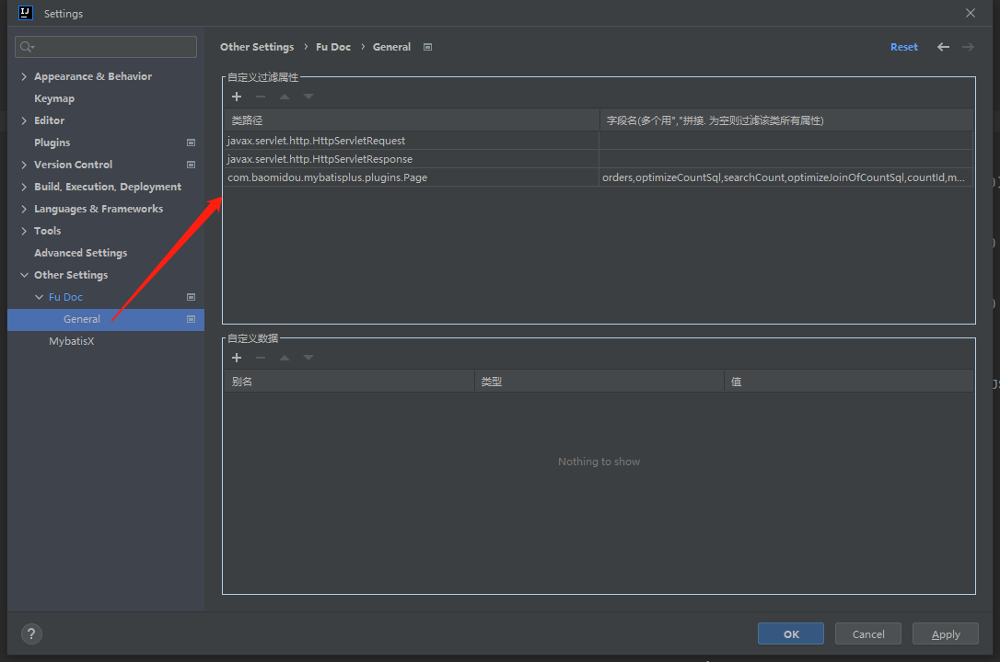

## 动态接口文档模板

!> 注意：由于需要支持markdown格式 配置模板中所有用于渲染的内容（除指令标签之外） 前面均不能有空格 必须完全靠左 如下图所示



?> 动态接口文档模板底层通过`freemarker`来将数据渲染到模板中 所以在模板中可直接使用`freemarker`指令


### 自定义数据

- 在配置页面配置自定义数据配置项


- 在模板中使用自定义数据配置项

```injectedfreemarker
<#if fudoc.pms?? >
**PmsKey权限**
- ${fudoc.pms}
</#if>

```

- 生成接口文档后的效果


?> 在配置页面配置了`setting_customer_value`属性后 可以直接在模板中使用`fudoc.alais`来读取自定义数据

---


### 注释tag

- 在代码里编写注释tag


- 在模板中使用注释tag

```injectedfreemarker
<#if fudoc.exportType?? >
**导出key**
- ${fudoc.exportType}
</#if>
```

- 生成接口文档后的效果


?> 不需要任何配置 可以直接在模板中使用`fudoc.tag`来读取注释中指定tag的内容

## 类或则属性过滤

!> 目前`Fu Doc`默认过滤下方截图中的三个配置. 如果你还需要过滤某些属性的话. 直接在下方table中添加一行输入类名和对应属性即可




## 自定义数据

!> 目前`Fu Doc`没有默认配置自定义数据. 如果你有需要的话可以在下方table中添加上你需要读取数据的配置 目前只支持从枚举中读取

你可以[查看配置详情](/zh-cn/config#setting_customer_value)中的`setting_customer_value`属性来了解如何配置


