# 使用案例

!> 如果需要指定方法生成接口文档 则将光标停留在需要生成接口文档的方法上或方法体内在生成即可

!> 如果需要针对枚举字段生成枚举说明 则在字段注释上新增`@see 枚举类`即可
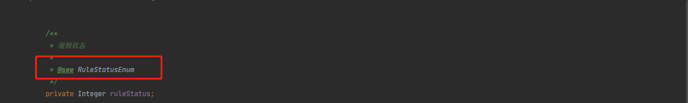

## `Controller`中一键生成接口文档

> 生成步骤截图

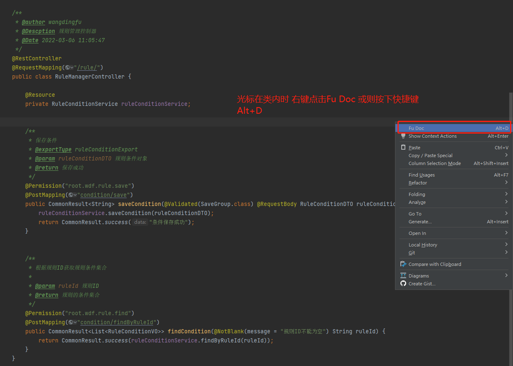
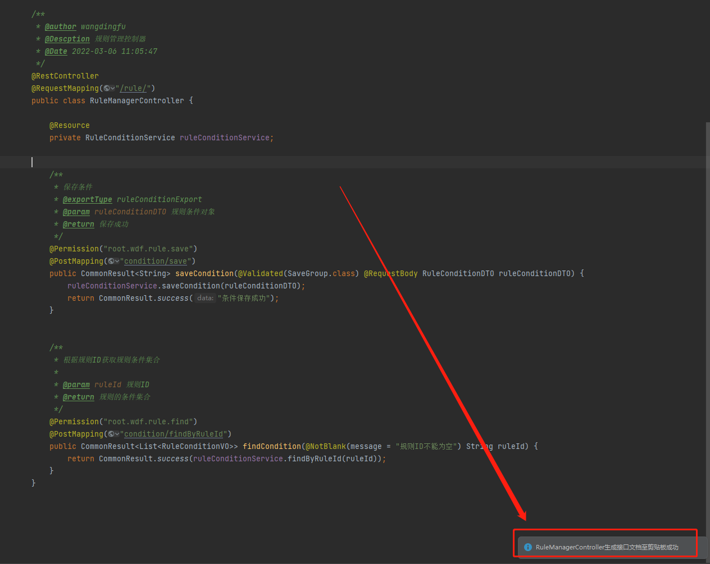

> 生成后的接口文档效果图

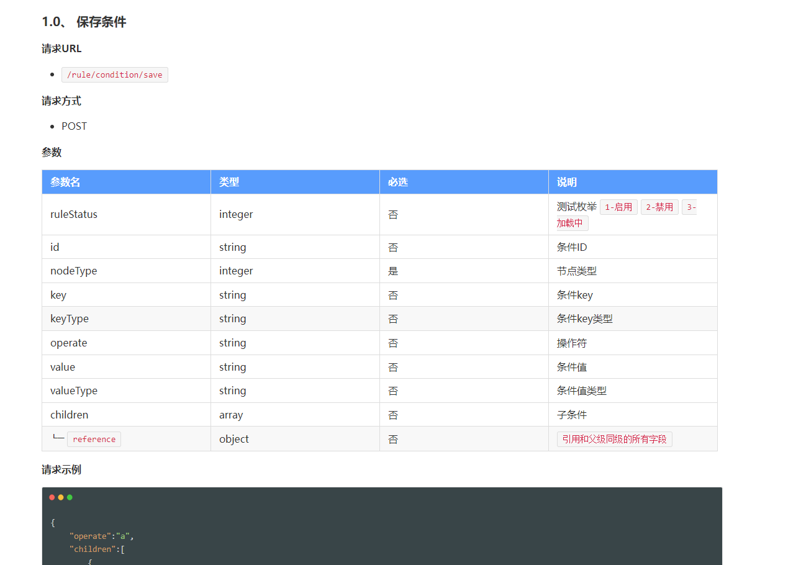
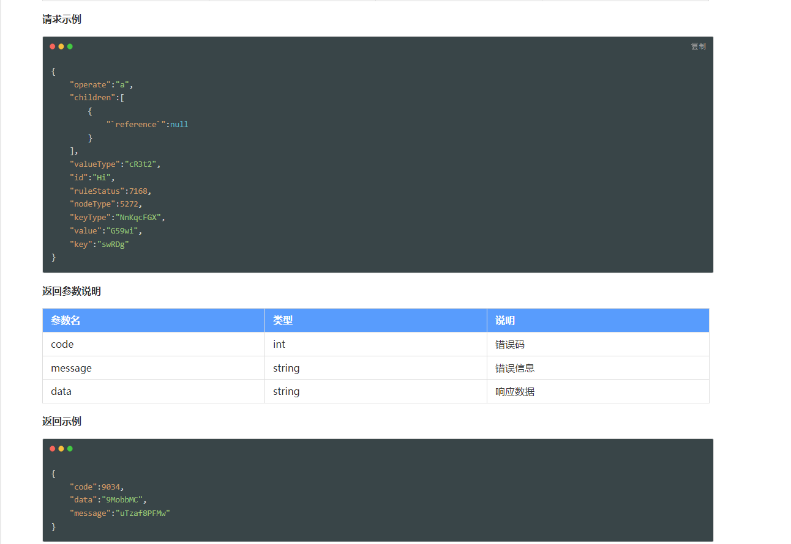
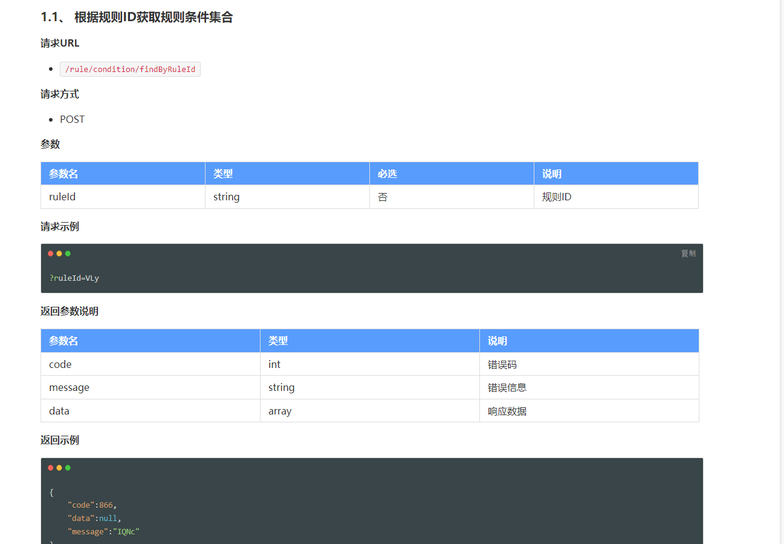

## `接口`中一键生成接口文档

> 生成步骤截图

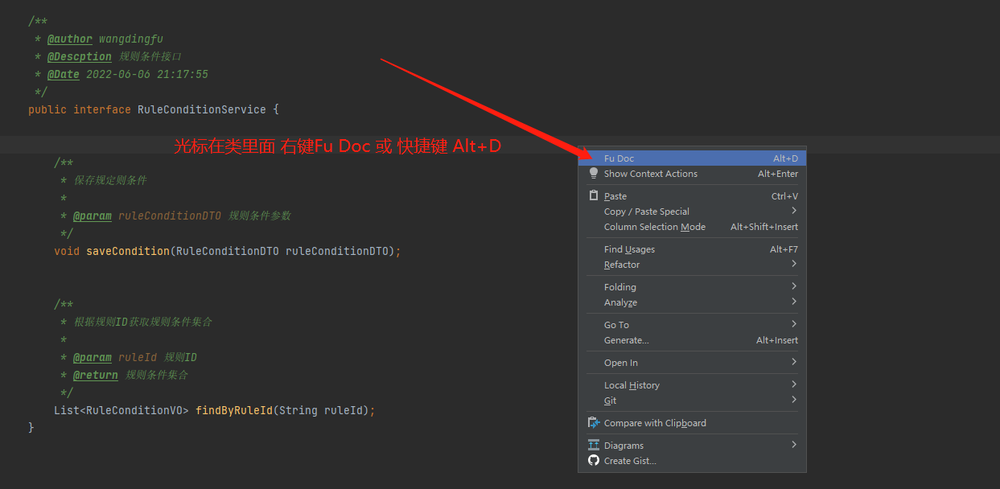
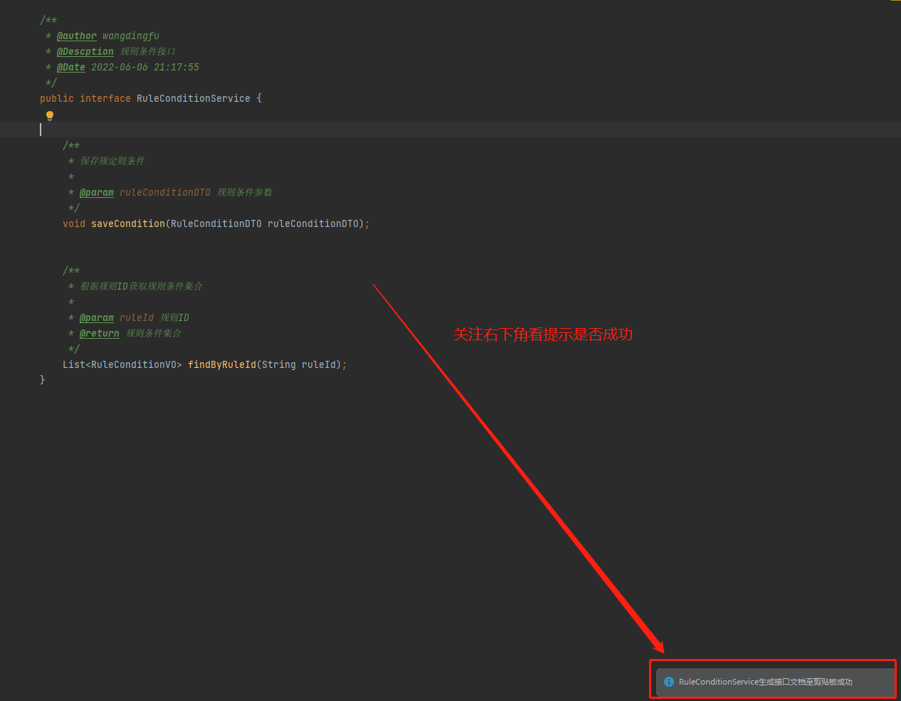
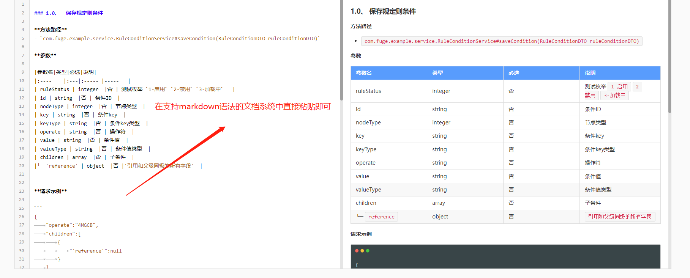

> 生成的效果图

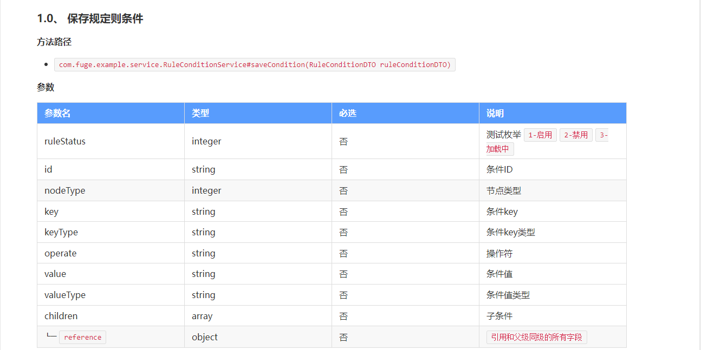

## `对象`中一键生成属性table

> 生成步骤截图

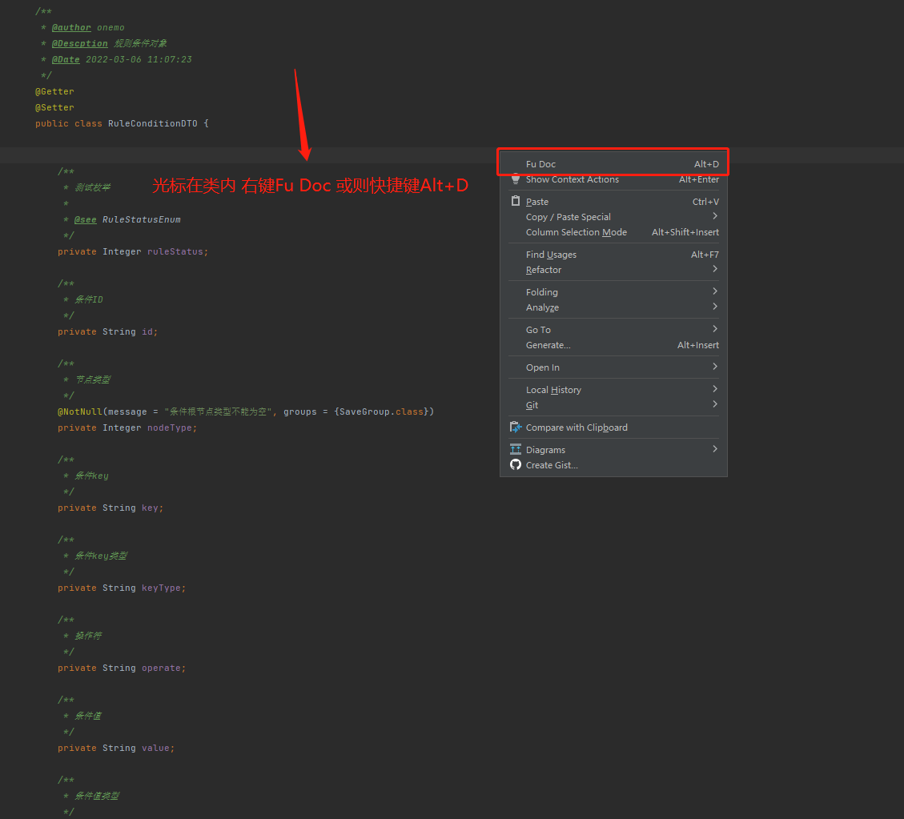
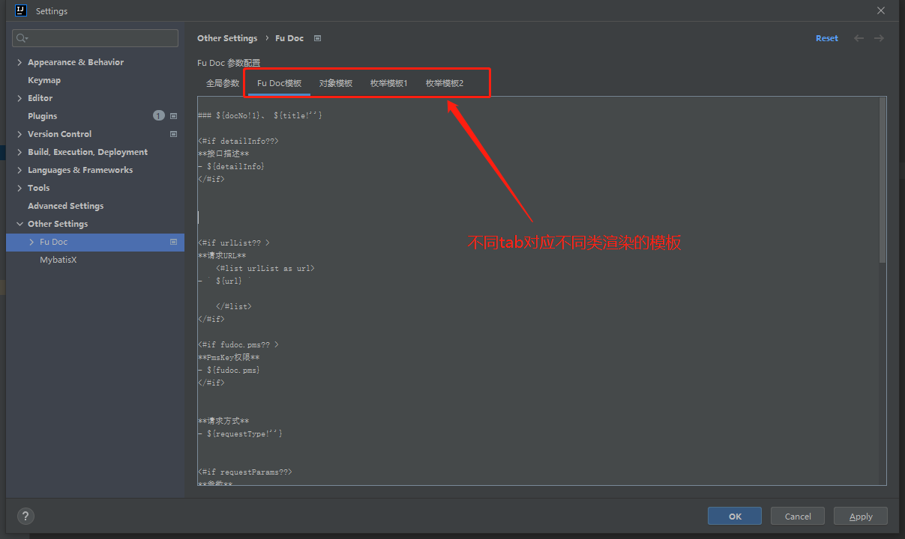
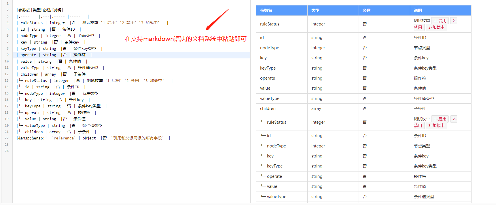

> 生成的效果图

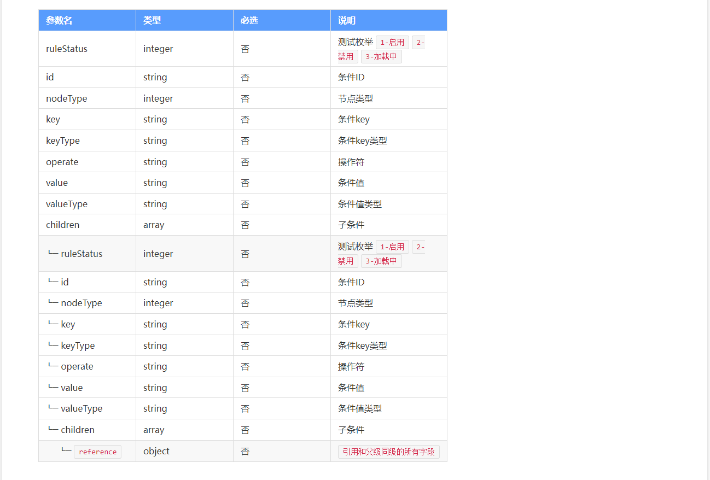

## `枚举`中一键生成字典说明

###### 生成`key-value`说明格式

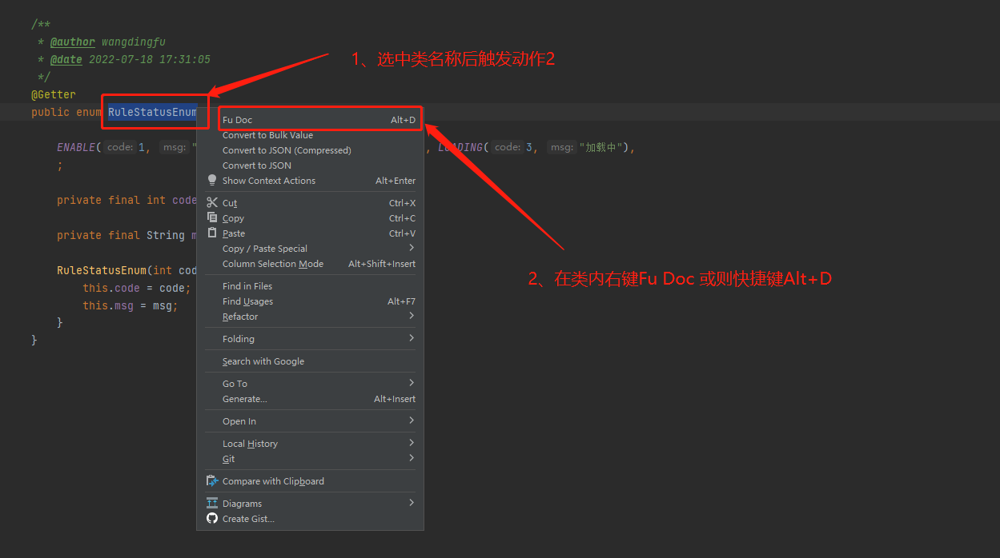
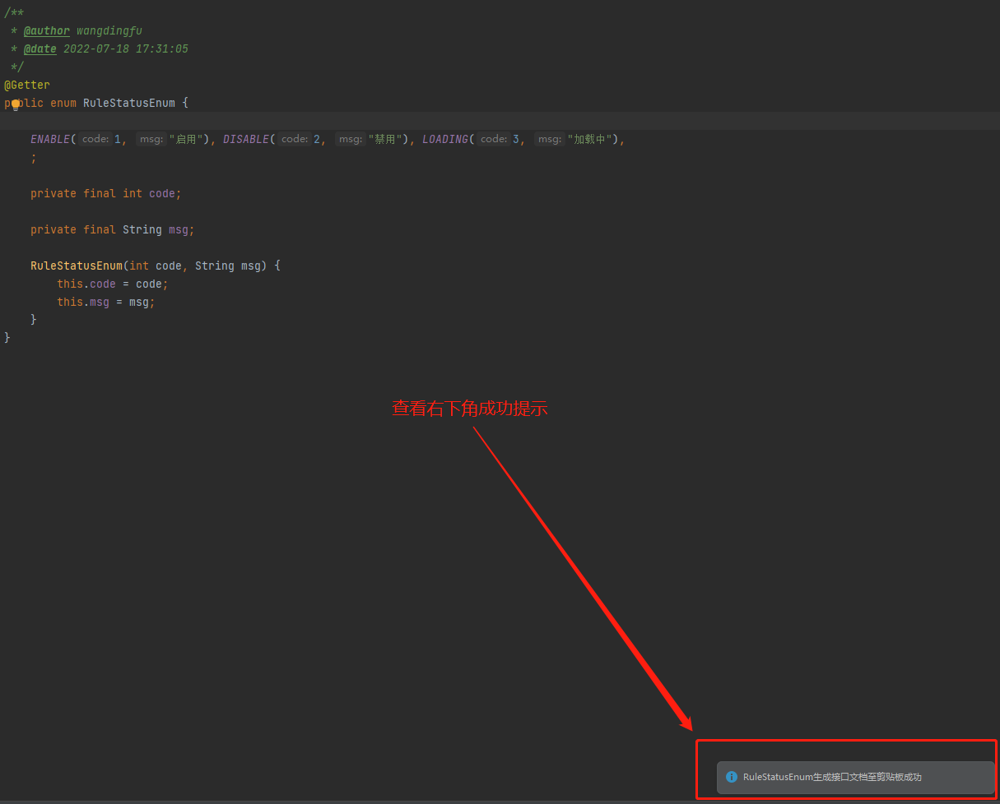

###### 生成字典table格式

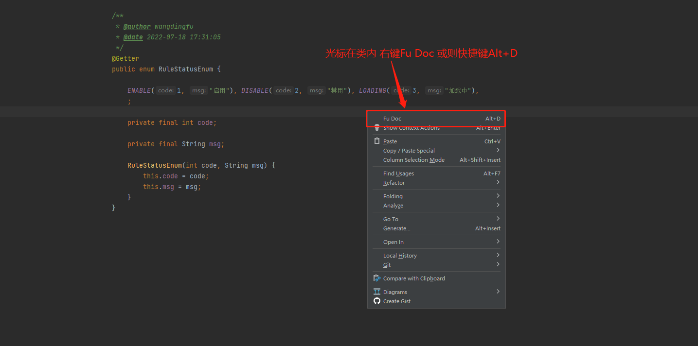

