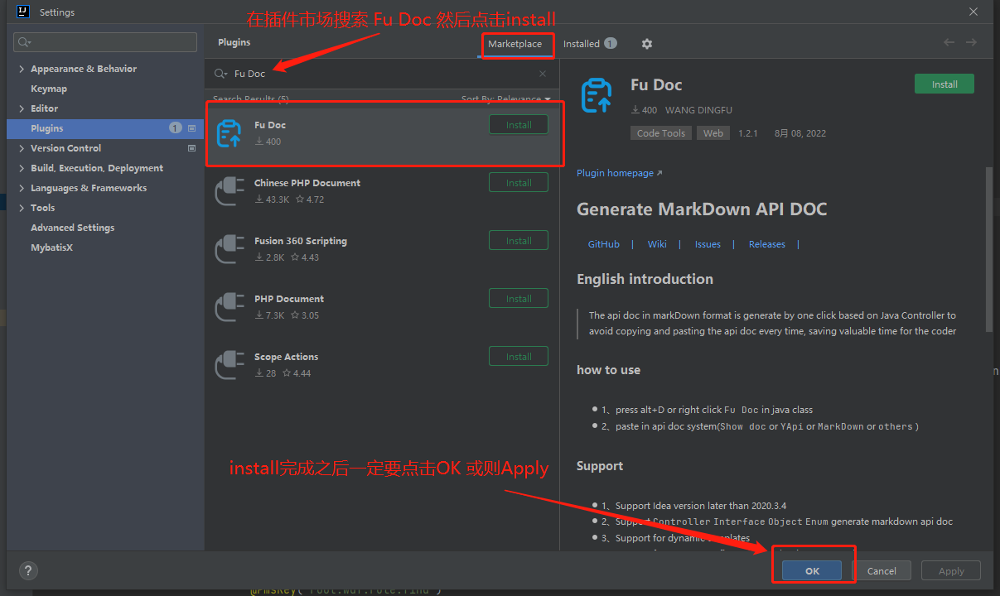

# 快速开始

> Fu Doc 是一款IDEA插件. 目前支持在`Spring Controller`类中按下快捷键`ALT+D`或者鼠标右键`Fu Doc`自动生成markdown格式接口文档到剪贴板中. 你只需要去你的文档系统将内容粘贴下来即可

## 安装

- **在线安装:**
  
    - `File` -> `Setting` -> `Plugins` -> 搜索 `Fu Doc`

- **手动安装:**
    - [下载插件（Github下载,速度慢）](https://github.com/wangdingfu/fu-api-doc-plugin/releases)
    - [下载插件（蓝奏云下载,速度快）](https://wwi.lanzoup.com/b0dy2hktg) 密码：`8vec`
    - [下载插件（百度云下载）](https://pan.baidu.com/s/1cC7thCMMdcRjh24sqU59tA?pwd=8888) 密码：`8888`
    - 进入插件市场安装本地插件： `File` -> `Setting` -> `Plugins`
      -> `Install Plugin from Disk...`

## 使用

- 快捷键`ALT+D`
- 右键菜单选择 `Fu Doc`
- 去接口文档系统直接将内容粘贴即可 :tada:

## 示例

可以查看 [示例](zh-cn/example.md) 来了解更多使用`Fu Doc`的案例。